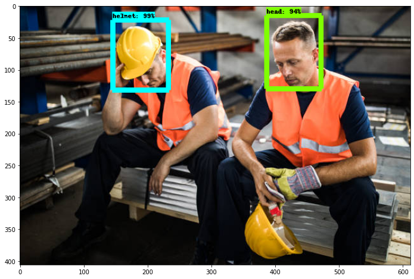
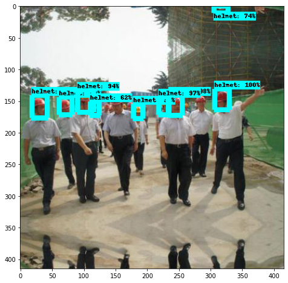

<h3> Project Case Study was featured by RoboFlow, a computer vision and object detection company.  https://blog.roboflow.com/computer-vision-detect-ppe-personal-protective-equipment/</h3>

<h1>Site Safety Assistant App:</h1>
<h3>Safety Violation Detector using Object Detection Neural Networks on images</h3>

<h2> Problem Statement</h2>

While safety is one of the most important parts of construction, a project can't be successful if it doesn't get built.  The superintendents, who are the General Contractor's on site representitives and who's primary goal is to ensure a project is to ensure a project is built to plan and on schedule.  Unfortunately, this can be difficult to achieve if they are constantly bogged down doing tedious paperwork.  Site Safety Assistant is a prototype that will give General Contractors the ability to quickly identify safety violations, as well as free up time for the superintendent to do their job by automatically filling out the necessary paperwork that goes along with any safety violations picked up by the App.

<h2> Executive Summary</h2>

With jobsite safety being one of the most important areas of a successful construction project, General Contractors and Superintendents spend much of their time every day ensuring that the safety plan that they developed is being followed.  From 2018 to 2019, construction injuries rose 61%, with over 5,000 workers dying on the job.  As a result, Department of Building inspections are on the rise.  If jobsite safety is not followed, those DoB inspections can lead to massive fines or even project shut downs.  If a contractor continuously violates safety protocols, they can get a permanent mark in their record as an unsafe GC, which will make it much more difficult to win contracts.  

General Contractors, are responsible for everyone on their site.  Even if a subcontractor is not their direct employee, the DoB will fine or shut down the GC for violations their subcontractor commits.  As a result, quickly identifying and rectifying safety violations in a quick manner is of the utmost importance.  The last thing a GC wants is for someone they are responsible for to get injured or worse.  

To create the Site Safety Assistant prototype, I focused on one of the most common safety violations seen on site, which is workers not wearing their hard hat.  I gathered over 8,000 images and separated them into three different classes (hard hat, not hard hat and both).  Using Roboflow.com, I was able to simply annotate all the image data for my Convolutional Neural Network.  

<h2> Methodology </h2>

To begin, I pulled of images from google of constructions workers on site.  Initially, I tried to just scrape images off of Google to streamline the process.  Unfortunately, most of the images that were pulled were cartoons or images that were of models dressed up as construction workers so I had to manually pull the images pull the images due to the lack of data that I was targeting. 

After compiling the images, I used Roboflow to annotate all of the images.  Roboflow allows for rapid image processing for object detection models by giving users the ability to annotate images then choose the format they wish to use the images in.  It also reshapes all of the images so that they are uniform and compresses them so that they don't use up as much memory allowing the final model to process the image data at a faster rate.

I then used the data to create multiple Convolutional Neural Networks (CNN) as well as using the pretrained MobileNet model, to see which would work best. Finally, I used this CNN model to create the Site Safety Assistant Application on streamlit.

<h2> Data Analysis and Findings</h2>

At first, the CNN models kept classifying images as hard hat when the following were in the image:

- If the image had both hard hat and not hard hat
- If the person wore a hat
- If the person was bald

In order to solve this issue, I gathered an additional 1,000 images focusing on those three issues.  While scoring metrics did go down, this was because the model was still having difficulty classifying images that had both hard hat and not hard hat.  However, it was classifying those images as not hard hat, which, for the purposes of our application, was still properly identifying that there was a hard hat safety violation.

<h2> Image Detection in Action</h2>

    

    

<h2> Conclusions</h2>
Unfortunately, the construction industry is very reluctant to use more technology, being very rooted in "the old ways of doing things." However, the companies that have embraced technology have grown and seen productivity rise rapidly.  With the use of Site Safety Assistant, General Contractors can minimize project risk, increase jobsite safety and save a lot of time on paperwork.

<h2> Sources</h2>
https://www.youtube.com/watch?v=LY0YxXvEOsQ
https://blog.roboflow.com/training-a-tensorflow-object-detection-model-with-a-custom-dataset/
https://www.edureka.co/blog/tensorflow-object-detection-tutorial/
https://www.mygreatlearning.com/blog/object-detection-using-tensorflow/
https://towardsdatascience.com/custom-object-detection-using-tensorflow-from-scratch-e61da2e10087
